[문제 정의](##✅ 문제 정의)  
[데이터 수집](##✅ 데이터 수집)  
[EDA](##✅ EDA)  
[전처리](##✅ 전처리)  
[Feature 엔지니어링](##✅ Feature 엔지니어링)  
[모델 학습 및 평가](##✅ 모델 학습 및 평가)

# 📍 부동산 허위매물 분류

데이콘 해커톤 참여: 데이터 분석 머신러닝 프로젝트

**[ 프로젝트 설명 ]**

머신러닝 프로젝트 | 기간: 1주 | 개발인원: 1명 | 기여도: 100%

- 데이콘 해커톤에 참여하여 부동산 허위매물 분류를 위한 머신러닝 모델을 개발했습니다.
- **Macro F1 Score 87.79%**를 달성하며 **상위 10%** 안에 들었습니다.
- 데이터 특성과 도메인을 이해한 후, 데이터 전처리와 파생변수 생성을 수행하며 모델 성능이 향상됨을 확인했습니다.
- XGBoost와 LightGBM을 활용하여 모델을 학습했습니다.
- GridSearch와 HyperOpt를 사용해 하이퍼파라미터 튜닝을 수행하며 최적의 모델을 찾는 데 집중했습니다.

## ✅ 문제 정의

온라인에서 거래되는 부동산 허위매물의 건수는 해마다 증가하고 있으며, 이를 개재하는 중개사무소의 수도 함께 늘어나고 있다. 이로 인해 온라인 부동산 플랫폼을 이용하는 소비자들의 신뢰는 감소하고, 금전적 손해는 증가하고 있다. 따라서 허위매물을 효과적으로 탐지하고 제거함으로써, 신뢰도 높은 부동산 거래 환경을 조성하는 데 기여할 수 있다.

## ✅ 데이터 확인

- train  
  엔트리: 2452 / 독립변수: 16개 / 종속변수: 1개(허위매물 여부: 0 또는 1)
- test  
  엔트리: 613 / 독립변수: 16개

**[ 독립변수 ]**
| 변수명 | 단위 | 데이터 타입 |
| ------ | ------ | ------ |
| ID | - | Object |
| 매물확인방식 | - | Object |
| 보증금 | 원 | Float |
| 월세 | 원 | Int |
| 전용면적 | ㎡ | Float |
| 해당층 | - | Float |
| 총층 | - | Float |
| 방향 | - | Object |
| 방수 | - | Float |
| 욕실수 | - | Float |
| 주차가능여부 | 0, 1 | Float |
| 총주차대수 | - | Float |
| 관리비 | 만원 | Int |
| 중개사무소 | - | Object |
| 제공플랫폼 | - | Object |
| 개재일 | 년-월-일 | Object |

**[ 종속변수 ]**
| 변수명 | 단위 | 데이터 타입 |
| ------ | ------ | ------ |
| 허위매물여부 | 0, 1(허위매물) | bool |

## ✅ EDA

**[ 결측치 확인 ]**

- train  
  전용면적: 787개 / 욕실: 18개 / 방수: 16개 / 해당층: 229개 / 총층: 16개 / 총주차대수: 696개
- test  
   184개 / 욕실: 2개 / 방수: 2개 / 해당층: 50개 / 총층: 2개 /
  총주차대수: 175개

| train                          | test                          |
| ------------------------------ | ----------------------------- |
| 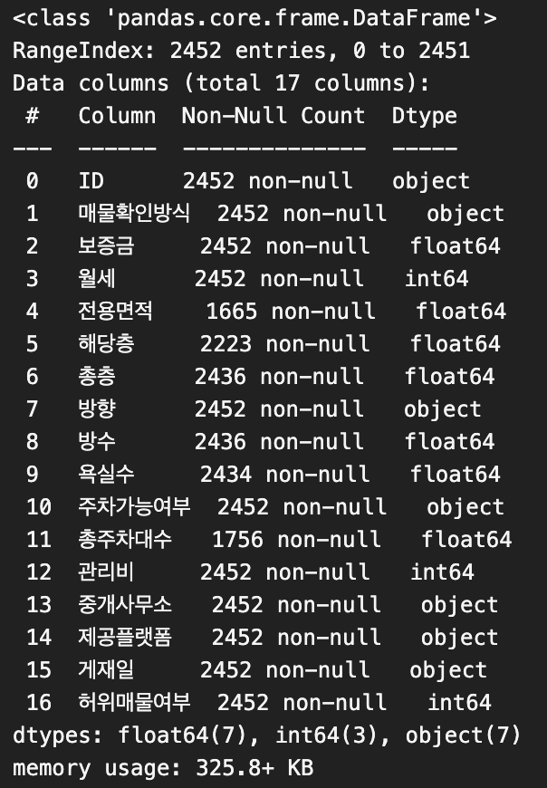 | 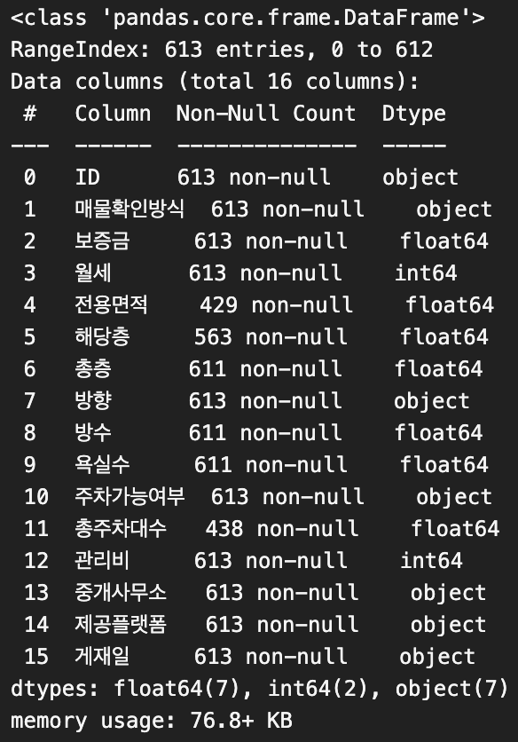 |

**[ 이상치 확인 ]**

| 관리비                      | 총주차대수                  |
| --------------------------- | --------------------------- |
| 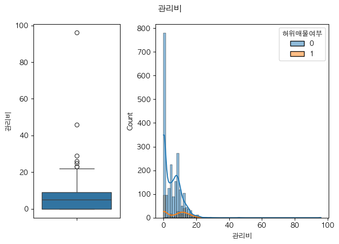 | 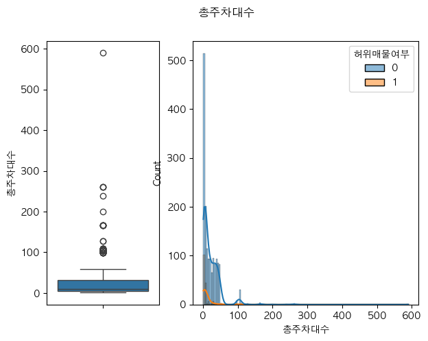 |

**[ 추가 EDA ]**

- train 데이터의 허위 매물과 정상 매물의 불균형  
  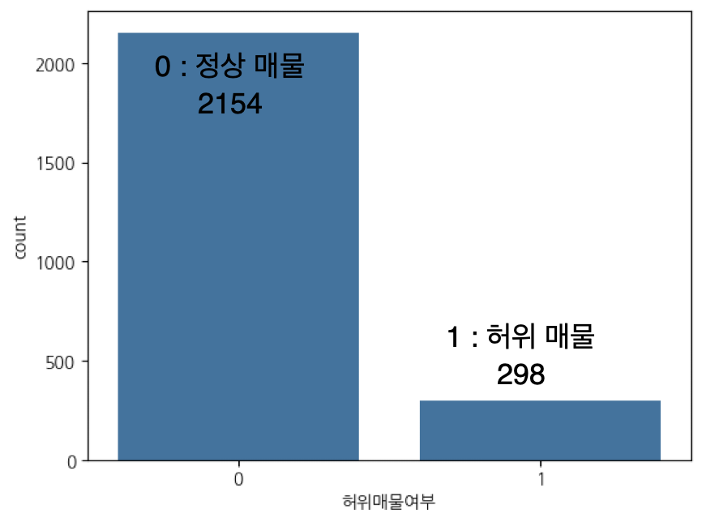

- train/test 데이터 비교🚨🚨🚨🚨🚨🚨
- 보증금
  | 보증금 | 보증금을 세 그룹으로 분류 |
  | ----------------------------- | ----------------------------- |
  | 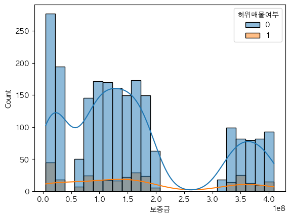 | 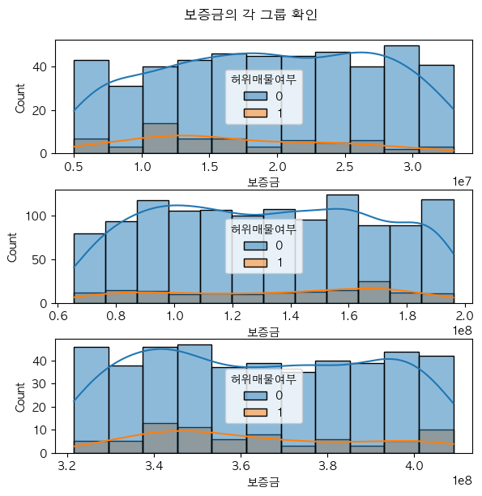 |

## ✅ 전처리

**[ 단위 통일 ]**

- 보증금, 월세: 원 → 만원
- 관리비: 만원

**[ 결측치 및 이상치 처리 ]**

- 전용면적 : 방수, 욕실수 조합의 평균으로 대체  
  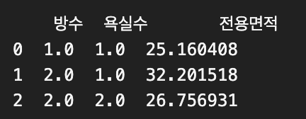

- 욕실수, 방수 : 가장 많은 수인 1로 채움
- 총층, 해당층, 총주차대수 : 반올림한 평균으로 대체

**[ 스케일링 및 인코딩 ]**🚨🚨🚨🚨🚨🚨

- 스케일링: Min-Max-Scaling 사용
- 인코딩: Label Incoding 사용  
  매물확인방식, 방향, 주차가능여부, 중개사무소, 제공플랫폼 라벨 인코딩

**[ 파생변수 생성 ]**

- 방치일수: 게재일로 부터 현재까지의 일수
- 미기재: NA 변수의 개수
- 집세: 관리비 + 월세

## ✅ 모델 학습 및 평가

**[ 분석 환경 ]**

> python: 3.9.16  
> numpy: 1.26.4  
> pandas: 2.2.3  
> matplotlib: 3.9.2  
> scikit-learn: 1.0.2  
> XGBoost: 1.6.1  
> lightGBM: 3.3.5  
> imblearn: 0.12.3  
> hyperOpt: 0.2.7

**[ XGBoost ]**

- 제출 결과: 86.41%
- logloss
  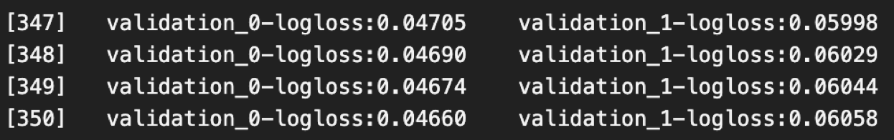
  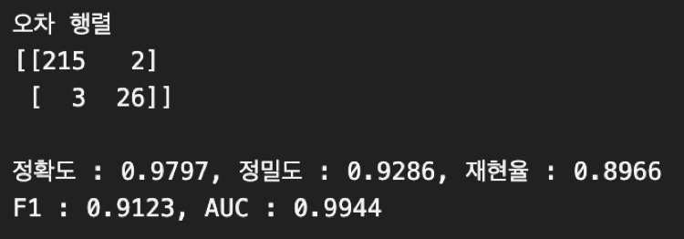

- ROC Curve  
  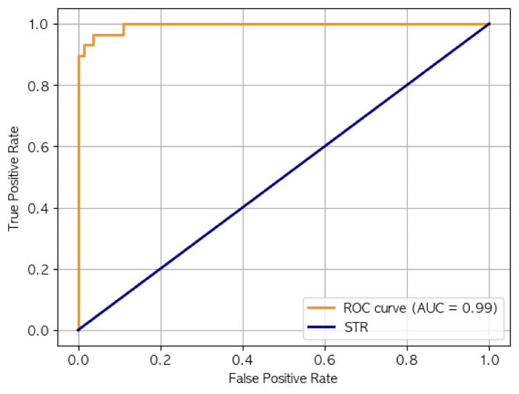

- Feature Importance
  | XGBoost | XGBoost + PCA |
  | ----------------------------- | ----------------------------- |
  | 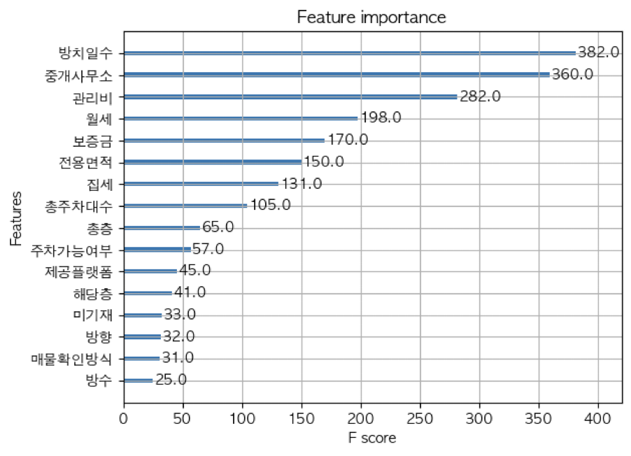 | 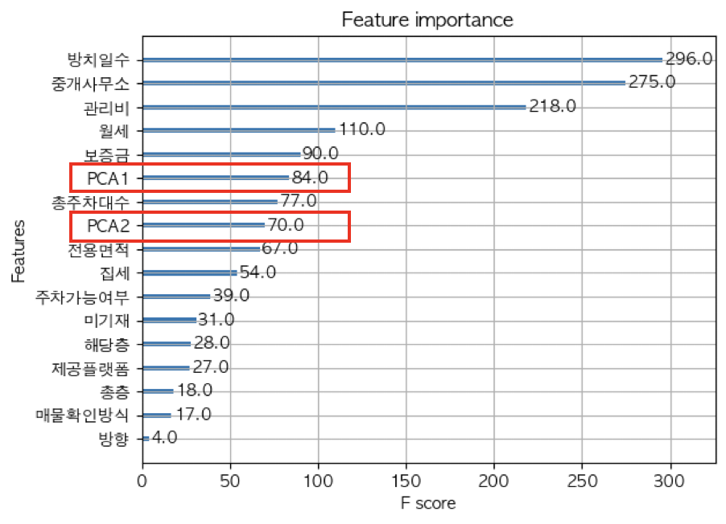 |

**[ LightGBM ]**

- 제출 결과: 87.78%
- logloss
  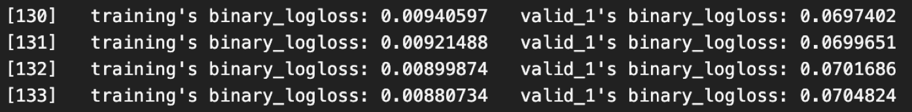
  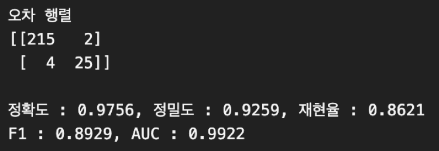

- ROC Curve  
  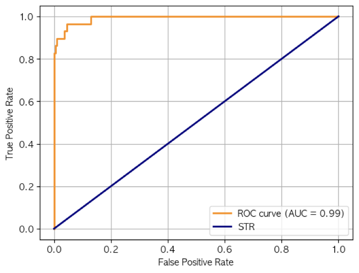

**[ XGBoost + GridSearchCV / HyperOpt ]**

- 제출 결과: 85.75%(GridSearchCV), 85.37%(HyperOpt)
- GridSearchCV
  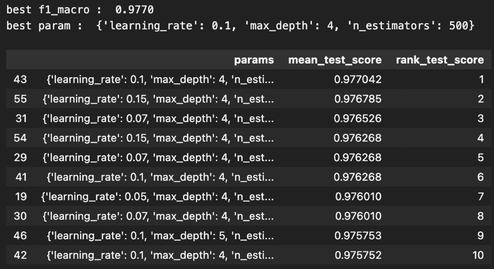
- HyperOpt
  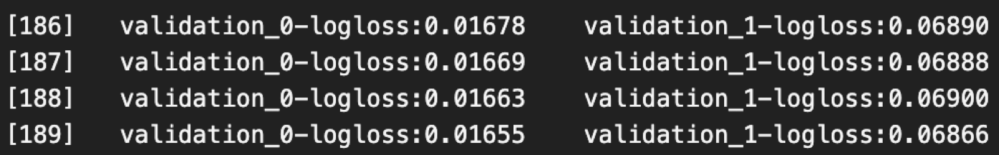
  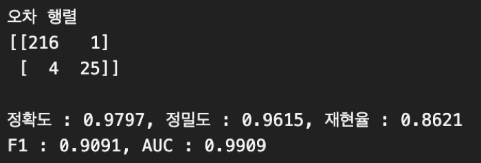

**[ LightGBM + GridSearchCV / HyperOpt ]**

- 제출 결과: 85.22%(GridSearchCV), 86.41%(HyperOpt)
- GridSearchCV
  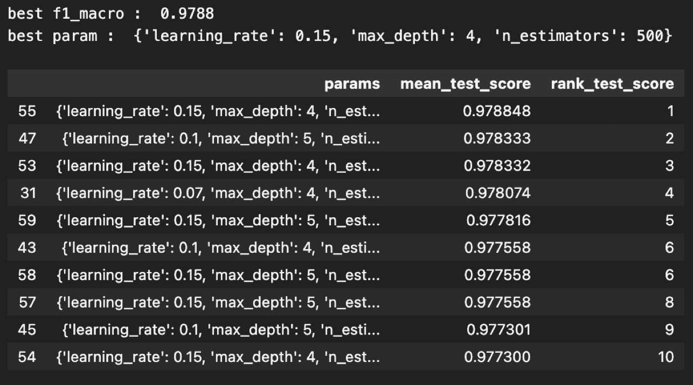
- HyperOpt
  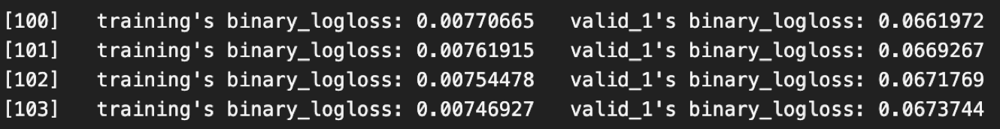
  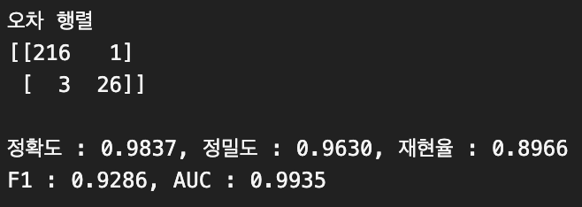
